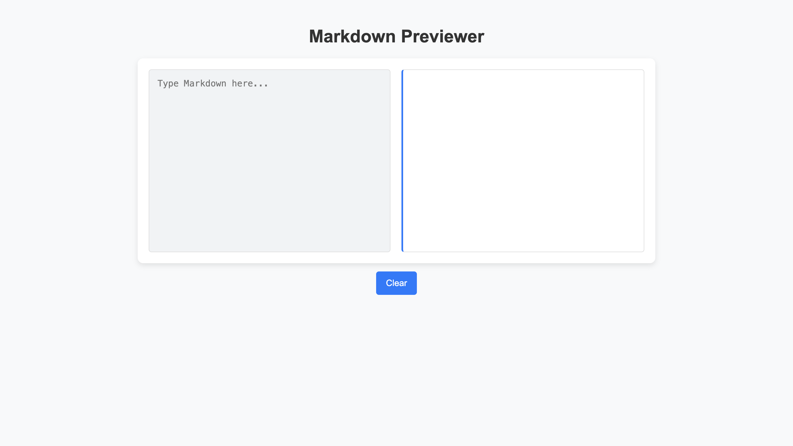

# Markdown Previewer

A simple Markdown Previewer built using HTML, CSS, and JavaScript. This application allows users to enter Markdown text into a textarea, and it will display a formatted preview in real-time without any API calls to the backend. The preview supports various Markdown elements like headings, bold, italics, links, and lists.

## Features

- **Live Preview**: See the formatted Markdown content instantly.
- **Markdown Elements Supported**:
  - Headings (`# H1`, `## H2`, etc.)
  - Bold (`**bold**`)
  - Italics (`*italic*`)
  - Links (`[title](http://example.com)`)
  - Lists (ordered and unordered)
- **Clear Button**: Reset the textarea to start fresh.
- **Responsive Design**: The app is fully responsive and works across all devices (mobile, tablet, desktop).

## Demo

You can view a live demo of this project here: [Live Demo](https://mark-down-one.vercel.app/)

## 📸 Screenshots

## Technologies Used

- **HTML**: Basic structure of the page.
- **CSS**: Used for styling the app and making it responsive.
- **JavaScript**: Handles parsing the Markdown input and dynamically updating the preview.

